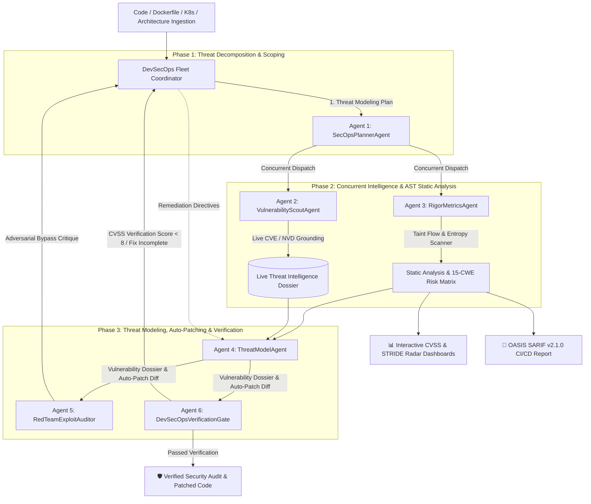

# Enterprise Autonomous DevSecOps & Security War-Room Fleet
[](https://www.python.org/downloads/)
[](https://pypi.org/project/google-genai/)
[](https://docs.oasis-open.org/sarif/sarif/v2.1.0/sarif-v2.1.0.html)
[](https://www.docker.com/)
[](LICENSE)

An enterprise-grade, closed-loop **Autonomous DevSecOps & Security War-Room Platform** powered by the **`google-genai`** SDK, Gemini 3.7 Thinking Budget reasoning, real-time Google Search Grounding for live CVEs/NVD advisories, Shannon entropy secret detection, Python AST static code analysis with Dataflow Taint Tracking across 15 CWE categories, OASIS SARIF v2.1.0 reporting, STRIDE threat modeling, adversarial red-team exploit simulations, and automated code remediation patches.

---

## 🏛️ System Architecture & 6-Agent DevSecOps Topology

The fleet orchestrates an autonomous, closed-loop DevSecOps war-room where each sub-agent executes a specialized security function with concurrent threat ingestion:



---

## 🤖 Sub-Agent Roles & Security Capabilities

| Agent | Responsibility | Core Capabilities & Tooling |
| :--- | :--- | :--- |
| **1. SecOpsPlannerAgent** | Threat Decomposition & Scope Architect | Generates structured Pydantic `SecurityAuditPlan` mapping STRIDE vectors and CWE attack surfaces. |
| **2. VulnerabilityScoutAgent** | Real-Time Threat Intel & CVE Grounding | Native `types.GoogleSearch()` grounding querying NVD, OSV (PyPI, npm, Go, Rust, Java), and Google Security advisories. |
| **3. RigorMetricsAgent** | Python AST Analysis & Shannon Secret Scanner | Native Python `ast.NodeVisitor` engine with **Dataflow Taint Tracking across 15 CWE categories** and Shannon entropy ($H(X)$) leaks. |
| **4. ThreatModelAgent** | Principal Security Architect & Auto-Patcher | Synthesizes full STRIDE threat models, authoring **ready-to-deploy remediated code patches and unified Git diffs**. |
| **5. RedTeamExploitAuditor** | Adversarial Hacker & Bypass Auditor | Simulates exploit payloads against proposed code patches to test for bypasses and secondary attack surfaces. |
| **6. DevSecOpsVerificationGate** | Quality Gatekeeper & CVSS Validator | Rigorous Pydantic quality gate checking CVSS score reductions and patch completeness; triggers self-correction loops. |

---

## 📖 How to Use the DevSecOps War-Room (Step-by-Step)

Follow this end-to-end workflow to audit, threat-model, and patch your applications:

### Step 1: Configure Your API Key
- Provide your **Gemini API Key** via the sidebar input field, or configure `GEMINI_API_KEY` inside your root `.env` file.
- The control plane will display a green `API Key Active (GenAI 1.x Connected)` indicator when connected.

### Step 2: Select or Ingest Target Code
Choose one of the 4 built-in preset scenarios or upload your own files:
- **Preset 1: Flask Microservice:** Insecure SQLi (CWE-89), OS Command Injection (CWE-78), SSRF (CWE-918), and hardcoded JWT secrets.
- **Preset 2: Dockerfile & Config:** Root container execution (CWE-250) and hardcoded AWS access keys (CWE-798).
- **Preset 3: Data Ingestion Pipeline:** Insecure YAML/pickle deserialization (CWE-502), dynamic `eval()` (CWE-95), and path traversal (CWE-22).
- **Preset 4: Kubernetes & Cloud Infrastructure:** Privileged container pods (CWE-269), open `0.0.0.0/0` SSH ingress rules (CWE-284), and Stripe API keys.
- **File Upload / Custom:** Upload `.py`, `.dockerfile`, `.yaml`, `.tf`, `.json`, or `.sh` files directly.

### Step 3: Tune Engine & Reasoning Parameters
In the left sidebar control plane:
- **Gemini Frontier Model:** Select `gemini-3.7-flash`, `gemini-3.5-flash`, etc.
- **Live CVE & NVD Search Grounding:** Toggle real-time Google Search grounding on/off.
- **Reasoning Budget (tokens):** Adjust the Gemini 3.7 Thinking Budget (e.g. 1024 to 4096 tokens) for deep reflection before threat model synthesis.
- **Adversarial Fix Loops:** Set maximum self-correction cycles (1 to 3 loops) if Red-Team bypasses are detected.

### Step 4: Run the Audit & Monitor Live Telemetry
- Click **`⚡ Run DevSecOps Audit & Autonomous Patch`**.
- Watch the 6 sub-agents execute with concurrent threat intelligence and timestamped telemetry logs showing scope decomposition, AST heuristics, live CVE citations, and adversarial stress-testing.

### Step 5: Explore the 9 High-Density War-Room Tabs
1. **Diff & Patch:** High-contrast side-by-side original vs. patched code comparison with unified Git diff.
2. **STRIDE Whitepaper:** Full enterprise STRIDE threat assessment with root-cause analysis and CVSS 3.1 ratings.
3. **Radar & CVSS:** Interactive Plotly STRIDE radar polygon, CVSS 3.1 base score gauge, and risk distribution charts.
4. **AST & Secrets:** Line-by-line breakdown of detected CWE flaws and high-entropy secret tokens ($H(X)$).
5. **CVE Grounding:** Live search queries and verified NVD/Google Security advisory URLs.
6. **Red-Team Audit:** Adversarial exploit simulation results verifying patch robustness.
7. **SARIF & CI/CD:** Schema-valid OASIS SARIF v2.1.0 JSON ready for pipeline ingestion.
8. **Field Manual (ℹ️):** In-depth technical guide, Shannon entropy formulas, and AST definitions.
9. **Telemetry:** Full timestamped audit session logs and session state JSON export.

### Step 6: Deploy & Apply the Remediated Patch
Download the generated artifacts directly:
```bash
# 1. Apply the unified Git patch
git apply security_patch.diff

# 2. Or replace with the drop-in remediated file
cp hardened_remediation.py src/app.py
```

---

## ⚡ Quickstart & Local Installation

### 1. Prerequisites
- Python 3.10+
- Google Gemini API Key ([Get one at Google AI Studio](https://aistudio.google.com/))

### 2. Clone and Setup Environment
```bash
# Clone the repository
git clone https://github.com/your-org/enterprise-agent-fleet.git
cd enterprise-agent-fleet

# Create and activate virtual environment
python -m venv venv
# On Windows:
.\venv\Scripts\activate
# On Linux/macOS:
source venv/bin/activate

# Install dependencies
pip install -r requirements.txt
```

### 3. Configure API Key
Create a `.env` file in the root directory:
```env
GEMINI_API_KEY=your_actual_gemini_api_key_here
```

### 4. Launch DevSecOps War-Room
```bash
streamlit run app.py
```
Open your browser at `http://localhost:8501`.

---

## 🐳 Docker Deployment

The application is containerized with non-root security principles (`appuser` UID 10001) and healthchecks.

### Run with Docker Compose
```bash
docker compose up --build -d
```

### Build & Run Manually
```bash
# Build the container image
docker build -t google-secops-fleet .

# Run with environment variable
docker run -d -p 8501:8501 --env-file .env --name secops-fleet google-secops-fleet
```

---

## 🚀 CI/CD Integration Guide (GitHub Actions & GitLab)

### GitHub Actions Integration
Add this step to your `.github/workflows/security.yml` to automatically upload the generated SARIF report:
```yaml
- name: Upload DevSecOps Fleet SARIF Report
  uses: github/codeql-action/upload-sarif@v3
  with:
    sarif_file: security_scan.sarif
```

---

## 🧪 Running the Test Suite

Run the full automated unit and integration test suite (38 passing tests):
```bash
pytest tests/ -v
```

Syntax compilation check:
```bash
python -m py_compile agents.py tools.py app.py
```

---

## 🛡️ Security & Enterprise Capabilities

- **Principle of Least Privilege**: Containers execute under an unprivileged `appuser` (UID 10001).
- **High-Entropy Secret Scanning**: Mathematical entropy detection ($H(X)$) flags exposed credentials in code and configurations.
- **AST Static Analysis with Dataflow Taint Tracking Across 15 CWEs**: Covers SQLi (CWE-89), OS Command Injection (CWE-78), SSRF (CWE-918), Path Traversal (CWE-22), Insecure Deserialization (CWE-502), Eval (CWE-95), Weak Crypto (CWE-327), Insecure Cookies (CWE-614/CWE-1004), Temp Files (CWE-377), Weak PRNG (CWE-338), Insecure Public Debug (CWE-1327), Disabled SSL Verification (CWE-295), Reflected XSS/SSTI (CWE-79), XML External Entity XXE (CWE-611), and Hardcoded Secrets (CWE-798).
- **Cloud & Infrastructure Scanning**: Evaluates Kubernetes Pod security contexts (CWE-269), Docker root execution (CWE-250), and Terraform open ingress rules (CWE-284).
- **OASIS SARIF v2.1.0 Standard**: Export structured findings for direct GitHub Security and GitLab CI/CD SAST integration.
- **Closed-Loop Self-Correction**: Red-team adversarial exploit testing forces automated patch regeneration if bypasses exist.
- **Concurrent Fleet Orchestration**: High-throughput thread-safe parallel intelligence gathering.
- **Deterministic Schemas**: All agent handoffs use strict Pydantic v2 models.

---

## 📄 License
This project is licensed under the Apache 2.0 License.
